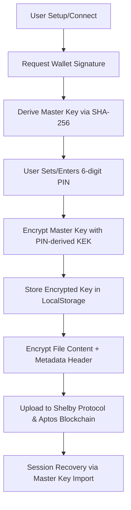

# 🔐 SoobinVault Protocol: Developer & Integration Guide

SoobinVault is a production-grade **Zero-Knowledge Storage Vault** built on top of the **Aptos Blockchain** and **Shelby Protocol**. It allows users to encrypt and distribute files across a decentralized network where only the owner (via their wallet signature) can access and decrypt the data.

🌐 **Live Website:** [https://soobinvault.vercel.app/](https://soobinvault.vercel.app/)

---

## 🚀 Key Features for Users & Developers

- 🛡️ **Zero-Knowledge Architecture:** Files are encrypted client-side using **AES-256-GCM** before ever leaving the browser.
- 🔐 **Mandatory PIN Protection:** Every session is secured by a user-defined 6-digit PIN, encrypting your local vault key for maximum device-level security.
- 🔑 **Deterministic Key Derivation:** Derived from unique wallet signatures. No passwords or keys are ever stored on a centralized server.
- 🛠️ **Advanced Session Recovery:** Seamlessly restore your vault using a 64-character Master Key backup if you forget your local PIN.
- 🔒 **Security Hardened:** Implements strict **Content Security Policy (CSP)**, HSTS, and Anti-Clickjacking headers for a production-grade defense.
- 🔎 **Encrypted Metadata Search:** Privacy-preserving search mechanism using encrypted filename "hints".
- 📱 **Mobile-First UX:** Premium, responsive interface with consolidated search and sync controls.

---

## 🏗️ Technical Architecture

SoobinVault follows a strict **"Encrypt-then-Upload"** flow with a local security layer:



### 1. Key Derivation Logic
The session key is derived deterministically from a wallet signature of a static message:
`"Unlock SoobinVault Session. Nonce: soobinvault-v1"`

We use the wallet address as a salt to ensure the key is globally unique to the account. This allows users to access their files on any device by simply re-signing the message with the same wallet.

### 2. File Packaging Format
An encrypted "Vault Payload" consists of:
`IV (12 bytes) + Encrypted(Metadata_Size (4) + Metadata_JSON + File_Bytes)`

This ensures that file type, original name, and size are all protected by the same encryption as the file content itself.

### 3. Security Hardening
SoobinVault implements multiple layers of web security to protect user sessions:
- **Strict CSP:** Prevents unauthorized script execution and limits connections to known wallet and storage origins.
- **X-Frame-Options:** Set to `DENY` to prevent clickjacking attacks.
- **HSTS:** Enforces secure HTTPS connections for 1 year.
- **MIME Sniffing Prevention:** Uses `X-Content-Type-Options: nosniff`.

---

## 🛠️ Integration Guide for Developers

Developers can integrate SoobinVault's security layer into their own dApps or extend its capabilities.

### Prerequisites
- Node.js 18+
- Petra Wallet (or any Aptos-compatible wallet)
- Shelby Protocol API Key (Get one at [geomi.dev](https://geomi.dev))

### Setup Environment
```bash
git clone https://github.com/Zaynsky12/soobinvault.git
cd soobinvault
npm install
```

Create a `.env.local` file:
```env
NEXT_PUBLIC_SHELBY_API_KEY=your_shelby_api_key
```

### Core Utility: `@/utils/crypto.ts`
This is where the magic happens. You can use these utilities in your own modules:

```typescript
import { encryptFile, decryptFile, deriveKeyFromSignature } from '@/utils/crypto';

// 1. Signature -> Master Key
// canonicalSalt should be the account address padded to 64 chars
const key = await deriveKeyFromSignature(walletSignature, canonicalSalt);

// 2. Encryption
const encryptedPayload = await encryptFile(fileObject, key);

// 3. Decryption
const { blob, metadata } = await decryptFile(encryptedBuffer, key);
console.log(`Original Name: ${metadata.name}`);
```

### Context Provider: `VaultKeyContext.tsx`
Wrap your application in the `VaultKeyProvider` to manage the encryption state globally. This handles session persistence safely in memory and `localStorage`.

```tsx
import { useVaultKey } from '@/context/VaultKeyContext';

const { encryptionKey, ensureKey, lockVault } = useVaultKey();

// Trigger a signature request to unlock
const key = await ensureKey(); 

// To force a refresh (e.g., if user thinks key is wrong)
const refreshedKey = await ensureKey(true);
```

---

## 🔧 Deployment & Integration with Shelby

SoobinVault uses the `@shelby-protocol/sdk` and `react` hooks for reliable storage.

- **Upload:** Use `useUploadBlobs` to push encrypted `Uint8Array` data.
- **Fetch:** Use the `coordination.getAccountBlobs` method to list all assets associated with a wallet address.
- **Sync:** The application implements a `vault:refresh` event system to sync the UI across components when assets are updated.

---

## 🤝 Contribution
1.  **UI/UX:** We use GSAP for all animations. Please maintain the premium aesthetic.
2.  **Security:** Always ensure `crypto.subtle` operations are performed within a secure context (HTTPS).
3.  **Optimization:** Use the `Manual Sync` and `Re-Unlock` features to ensure session consistency across different wallet states.

---

## 📜 License & Acknowledgments
Built with 💖 for the **Aptos Ecosystem**. Special thanks to the **Shelby Protocol** team for providing the decentralized storage layer.

All cryptographic operations are performed strictly on the client-side. **Your keys, your data.**
