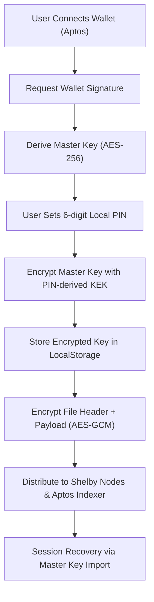

# 🔐 SoobinVault Protocol

SoobinVault is a production-grade **Zero-Knowledge Storage Vault** built on top of the **Aptos Blockchain** and **Shelby Protocol**. It empowers users with absolute data sovereignty by ensuring that files are encrypted locally and distributed across a decentralized network.

🌐 **Live Website:** [https://soobinvault.vercel.app/](https://soobinvault.vercel.app/)

---

## 🧐 What is SoobinVault?

Traditional cloud storage relies on centralized trust. SoobinVault replaces "Trust" with "Math". 
It is a non-custodial storage protocol where:
1.  **You Own the Keys:** Encryption keys are derived from your wallet signature.
2.  **Privacy by Default:** Metadata (filenames, types, sizes) is encrypted along with the content.
3.  **Local Security:** Sensible session management with mandatory PIN protection for your local device.

---

## 🚀 Key Features for Users & Developers

### 🛡️ Security First
- **Zero-Knowledge Architecture:** Files are encrypted client-side using **AES-256-GCM** before ever leaving the browser.
- **Mandatory PIN Protection:** Every session is secured by a user-defined 6-digit PIN, encrypting your local vault key for maximum device-level security.
- **Deterministic Key Derivation:** Derived from unique, verifiable wallet signatures. No passwords or keys are ever stored on any server.
- **Security Hardened:** Implements strict **Content Security Policy (CSP)**, HSTS, and Anti-Clickjacking headers.

### ⚡ Premium Experience
- **Advanced Session Recovery:** Seamlessly restore your vault using a 64-character Master Key backup if you forget your local PIN or move to a new device.
- **Mobile-First Design:** A sleek, responsive interface built with **Next.js 14** and **GSAP** for fluid animations.
- **Consolidated Controls:** Integrated search and sync/refresh tools for a clean, intuitive workspace.

---

## 🏗️ Technical Architecture

SoobinVault utilizes a layered security model to protect data at rest and in transit:

### The "Encrypt-then-Upload" Flow


### 1. Key Management Logic
The **Master Key** is derived deterministically from a wallet signature of a static, versioned message:
`"Unlock SoobinVault Session. Nonce: soobinvault-v1"`

To protect this key on the user's device, we use a **Key Encryption Key (KEK)** derived from a user's 6-digit PIN using **SHA-256**. The Master Key is stored in `localStorage` ONLY in its encrypted form.

### 2. Privacy-Preserving Search
FileName metadata is never stored in plaintext. SoobinVault uses base64-encoded encrypted "hints" that allow the UI to display and search for files locally without exposing their names to the storage provider.

---

## 🛠️ Integration Guide for Developers

### Prerequisites
- Node.js 18.17.0+
- Aptos-compatible wallet (Petra, Martian, etc.)
- Shelby Protocol API Key

### Installation
```bash
git clone https://github.com/Zaynsky12/soobinvault.git
cd soobinvault
npm install
```

### Environment Variables
Create a `.env.local` file in the root directory:
```env
NEXT_PUBLIC_SHELBY_API_KEY=your_shelby_api_key
```

### Core Cryptographic API (`@/utils/crypto.ts`)
You can use the internal crypto engine for your own decentralized applications:

```typescript
import { encryptFile, decryptFile, deriveKeyFromSignature } from '@/utils/crypto';

// 1. Signature -> Master Key
const masterKey = await deriveKeyFromSignature(walletSignature, accountAddress);

// 2. Client-side Encryption
const encryptedBuffer = await encryptFile(fileObject, masterKey);

// 3. Client-side Decryption
const { blob, metadata } = await decryptFile(encryptedBuffer, masterKey);
```

### State Management (`VaultKeyContext.tsx`)
The `VaultKeyProvider` manages the lifecycle of the encryption key, including PIN prompts and session locking.

```tsx
const { encryptionKey, ensureKey, lockVault } = useVaultKey();

// Trigger a secure unlock (Signature + PIN)
const activeKey = await ensureKey(); 
```

---

## 🤝 Contribution & Standards
1.  **Visuals:** Maintain the "Aesthetic" design language using GSAP and Tailwind CSS.
2.  **Security:** All cryptographic operations MUST stay on the client-side. Never log or transmit raw keys.
3.  **Performance:** Optimize for low latency during encryption of large files (>50MB).

---

## 📜 License & Credits
Built for the **Aptos Ecosystem**. Powered by the **Shelby Protocol** decentralized storage layer.

**Your keys, your data. Forever.**
 strictly on the client-side. **Your keys, your data.**
