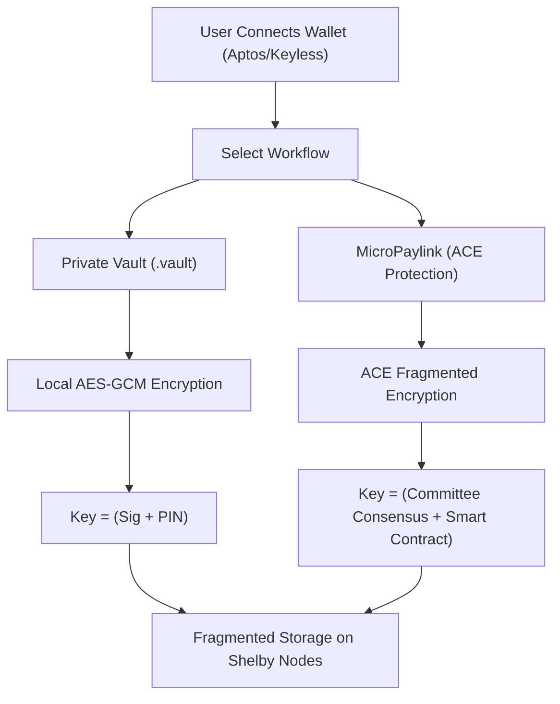

# 🔐 SoobinVault Protocol
## The Sovereign Layer for Decentralized AI & Private Assets

[](https://aptoslabs.com/)
[](https://shelby.protocol/)
[](https://github.com/aptos-labs/ace)

SoobinVault is a production-grade **Zero-Knowledge Storage & Monetization Protocol** built on the **Aptos Blockchain**. It empowers users with absolute data sovereignty, combining local-first encryption with a decentralized micropayment network.

🌐 **Experience the Future:** [soobinvault.vercel.app](https://soobinvault.vercel.app/)

---

## 🧐 The Vision
Traditional cloud storage requires you to sacrifice privacy for convenience. SoobinVault deletes that compromise. Using **Access Control Encryption (ACE)** and the **Shelby Protocol**, we've built a system where "Trust" is replaced by "Mathematics".

### 1. 🛡️ Private Vault (Secure Storage)
Your ultimate personal digital safe. 
- **ZK-Privacy:** Files are encrypted with **AES-256-GCM** client-side before they ever touch the network.
- **Identity-Based Keys:** Encryption keys are derived from your unique wallet signature.
- **Metadata Stealth:** Filenames and types are obfuscated, keeping your storage footprint invisible.

### 2. 🔗 MicroPaylinks (The Value Layer)
**New:** Transform any file into a decentralized revenue stream.
- **Pay-to-Decrypt:** Use ACE technology to lock assets. Keys are only released by a decentralized committee when payment is confirmed on-chain.
- **Direct P2P Sharing:** Create a **MicroPaylink**, share it anywhere, and get paid instantly in **ShelbyUSD (SUSD)**.
- **Immutable Access:** Buyers retain their cryptographic right to access purchased data forever, even if the seller goes offline.

---

## 🏗️ Technical Architecture

SoobinVault utilizes a multi-layered security model to ensure your assets are safe and your payments are secure.

### The "Sovereignty Flow"


---

## 🚀 Key Features

### 🔑 Keyless Compatibility
Full support for **Aptos Connect (Social Login)**. Secure your vault using Google or Apple accounts without managing complex seed phrases.

### 🛡️ ACE Protocol Integration
State-of-the-art Access Control Encryption ensures that gated content remains mathematically impossible to decrypt without a valid on-chain purchase.

### ⚡ Cinematic UX
A high-performance interface powered by **GSAP**, featuring liquid transitions, glassmorphic UI, and real-time blockchain synchronization.

### 🌍 Distributed Persistence
Files are not stored on a server. They are fractured and distributed across the **Shelby Protocol**'s decentralized node network, ensuring 99.9% availability and censorship resistance.

---

## 🛠️ Developer Setup

SoobinVault is a modern Next.js application.

```bash
# Clone the repository
git clone https://github.com/Zaynsky12/soobinvault.git

# Install dependencies
npm install

# Configure environment variables
cp .env.example .env.local

# Run development server
npm run dev
```

---

## 📜 Standards & Credits
Built with ❤️ for the **Aptos Ecosystem**. 

- **Blockchain:** Aptos Testnet
- **Storage:** [Shelby Protocol](https://shelby.protocol/)
- **Encryption:** [Aptos ACE SDK](https://github.com/aptos-labs/ace)
- **UI:** Next.js + TailwindCSS + GSAP

**Your Keys. Your Data. Your Value. Forever.**
