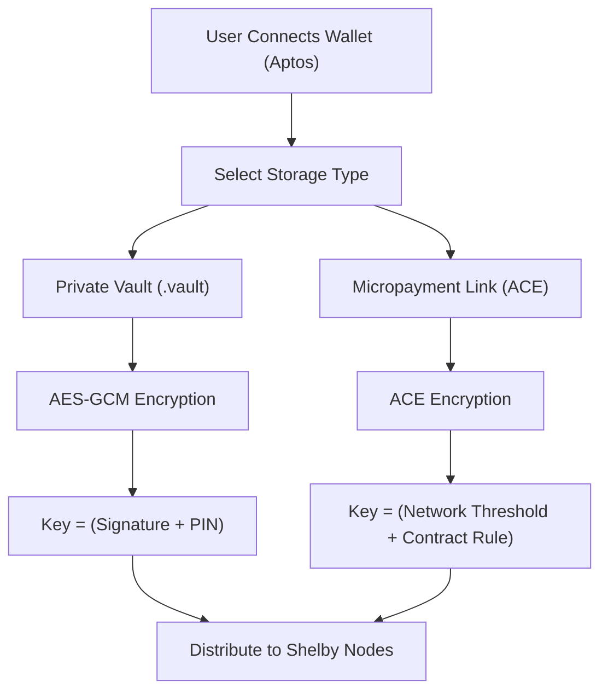

# 🔐 SoobinVault Protocol

SoobinVault is a production-grade **Zero-Knowledge Storage Vault** built on top of the **Aptos Blockchain** and **Shelby Protocol**. It empowers users with absolute data sovereignty by ensuring that files are encrypted locally and distributed across a decentralized network.

🌐 **Live Website:** [https://soobinvault.vercel.app/](https://soobinvault.vercel.app/)

## 🧐 What is SoobinVault?

Traditional cloud storage relies on centralized trust. SoobinVault replaces "Trust" with "Math". It is a dual-pillar decentralized storage protocol designed for both personal security and peer-to-peer value exchange.

### 1. 🛡️ Private Vault (The Digital Safe)
The Private Vault is your ultimate personal storage layer. 
- **Zero-Knowledge Privacy:** Files are encrypted client-side using **AES-256-GCM** before uploading.
- **Sole Ownership:** Only you hold the keys. Encryption keys are derived from your unique wallet signature and secured with a 6-digit local PIN.
- **Metadata Protection:** Filenames and types are obfuscated, ensuring your storage footprint remains invisible to the network.

### 2. 💸 Micropayment Links (The Value Layer)
SoobinVault scales beyond personal storage into a decentralized marketplace for digital assets.
- **ACE Technology:** Utilizes **Access Control Encryption (ACE)** to protect assets. Decryption rights are not fixed but are managed by on-chain smart contract conditions.
- **Direct P2P Monetization:** Share a link to your asset, and the network handles the payment and permissioning. Buyers pay in **ShelbyUSD (SUSD)**, and the smart contract automatically authorizes their decryption key.
- **Persistent Access:** Even if an asset is delisted, the owner and historical buyers retain their cryptographic right to access the data.

---

## 🏗️ Technical Architecture

SoobinVault utilizes a layered security model to protect data at rest and in transit:

### The "Double-Lock" Security Flow

### 1. Key Management Logic
The **Master Key** is derived deterministically from a wallet signature. For the Private Vault, we use a **Key Encryption Key (KEK)** derived from a user's 6-digit PIN to secure the Master Key locally. For Micropayments, the keys are managed by a decentralized committee of ACE workers that only release key fragments when on-chain conditions (like payment) are satisfied.

---

## 🚀 Key Features

### 🛡️ Security First
- **Deterministic Key Derivation:** No passwords are stored; access is tied to your cryptographic identity.
- **Access Control Encryption:** The state-of-the-art in decentralized permissioning, ensuring payment-gated content is mathematically secure.
- **Security Hardened:** Implements strict **Content Security Policy (CSP)** and anti-tamper headers.

### ⚡ Premium Experience
- **GSAP Driven UI:** A sleek, high-performance interface with fluid animations and micro-interactions.
- **Cross-Device Recovery:** Use your 64-character Master Key to restore your vault on any device without compromising security.

---

## 🤝 Standards & Guidelines
1.  **Privacy First:** All cryptographic operations MUST stay on the client-side or within the decentralized ACE worker network.
2.  **Aesthetics:** Maintain the premium "Dark Mode" aesthetic with consistent GSAP transitions.

---

## 📜 License & Credits
Built for the **Aptos Ecosystem**. Powered by the **Shelby Protocol** storage layer and **Aptos ACE SDK**.

**Your keys, your data. Forever.**

