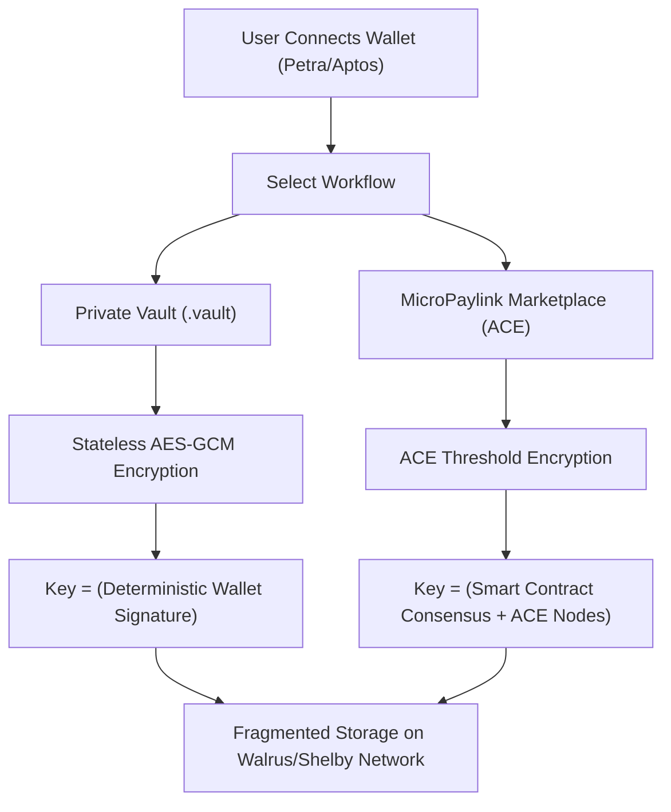

# 🔐 SoobinVault Protocol
## The Sovereign Layer for Decentralized AI & Private Assets

[](https://aptoslabs.com/)
[](https://shelby.protocol/)
[](https://github.com/aptos-labs/ace)

SoobinVault is a production-grade **Zero-Knowledge Storage & Monetization Protocol** built on the **Shelby Protocol**. It empowers users with absolute data sovereignty, combining stateless local-first encryption with a decentralized micropayment network.

🌐 **Experience the Future:** [soobinvault.vercel.app](https://soobinvault.vercel.app/)

---

## 🧐 The Vision
Traditional cloud storage requires you to sacrifice privacy for convenience. SoobinVault deletes that compromise. Using a **Stateless Deterministic Architecture**, **Access Control Encryption (ACE)**, and the **Shelby Protocol**, we've built a system where "Trust" is replaced by "Mathematics".

### 1. 🛡️ Private Vault (Stateless Secure Storage)
Your ultimate personal digital safe with zero local footprint.
- **Stateless Privacy:** Encryption keys only live in your device's RAM. We use **AES-256-GCM** client-side encryption. No PINs, no passwords, no `localStorage` vulnerabilities.
- **Deterministic Keys:** Session keys are derived dynamically and mathematically via your unique Aptos Wallet signature (`signMessage`).
- **Metadata Stealth:** Filenames and file types are completely obfuscated before leaving your device.

### 2. 🔗 MicroPaylinks (The AI Data Marketplace)
Transform any dataset or file into a decentralized revenue stream.
- **Pay-to-Decrypt:** Leveraging **Aptos Confidential Encryption (ACE)**. Assets are cryptographically locked and the decryption keys are only released by a decentralized node committee once the Smart Contract verifies the payment.
- **Direct P2P Sharing:** Create a **MicroPaylink**, share it globally, and earn **ShelbyUSD (SUSD)** directly into your wallet.
- **Immutable Access:** Buyers permanently retain their cryptographic right to access purchased data, establishing true digital ownership.
- **Architectural Constraint:** To prevent transaction spamming on the Aptos network and ensure reliable Marketplace contract registration, MicroPaylink uploads are strictly processed **one file per transaction**.

---

## 🏗️ Technical Architecture

SoobinVault utilizes a bifurcated security model to ensure private assets stay hidden while monetized assets remain liquid yet gated.

### The "Sovereignty Flow"

```mermaid
graph TD
    A["User Connects Wallet (Petra/Aptos)"] --> B["Select Workflow"]
    B --> C1["Private Vault (.vault)"]
    B --> C2["MicroPaylink Marketplace (ACE)"]
    
    C1 --> D1["Stateless AES-GCM Encryption"]
    D1 --> E1["Key = (Deterministic Wallet Signature)"]
    
    C2 --> D2["ACE Threshold Encryption"]
    D2 --> E2["Key = (Smart Contract Consensus + ACE Nodes)"]
    
    E1 --> F["Fragmented Storage on Walrus/Shelby Network"]
    E2 --> F
```

---

## 🚀 Key Features

### 👻 Stateless Cryptography (Zero-Footprint)
Session keys are derived deterministically in-memory via wallet signature. Zero keys are stored on your hard drive, completely neutralizing local credential theft.

### 🛡️ ACE Protocol Integration
State-of-the-art Access Control Encryption ensures that monetized content remains mathematically impossible to decrypt without a valid on-chain purchase verification.

### 💰 AI Data Monetization
Easily deploy AI datasets, creative assets, or confidential files into the MicroPaylink Marketplace. Earn ShelbyUSD seamlessly straight to your Aptos wallet on every unlock.

### ⚡ Cinematic Web3 UX
A high-performance interface powered by **GSAP** and Next.js, featuring liquid transitions, glassmorphic UI, and frictionless wallet auto-unlock flows.

### 🌍 Distributed Persistence
Files are not stored on centralized servers. They are fractured and distributed across the decentralized node network, ensuring high availability and censorship resistance.

---

## 🛠️ Developer Setup

SoobinVault is a modern Next.js application.

```bash
# Clone the repository
git clone https://github.com/Zaynsky12/soobinvault.git

# Install dependencies
npm install

# Configure environment variables
cp .env.example .env.local

# Run development server
npm run dev
```

---

## 📜 Standards & Credits
Built with ❤️ for the **Aptos Ecosystem**. 

- **Blockchain:** Aptos Testnet
- **Storage:** [Shelby Protocol](https://shelby.protocol/) / Walrus
- **Encryption:** [Aptos ACE SDK](https://github.com/aptos-labs/ace)
- **UI:** Next.js + TailwindCSS + GSAP

**Your Keys. Your Data. Your Value. Forever.**
